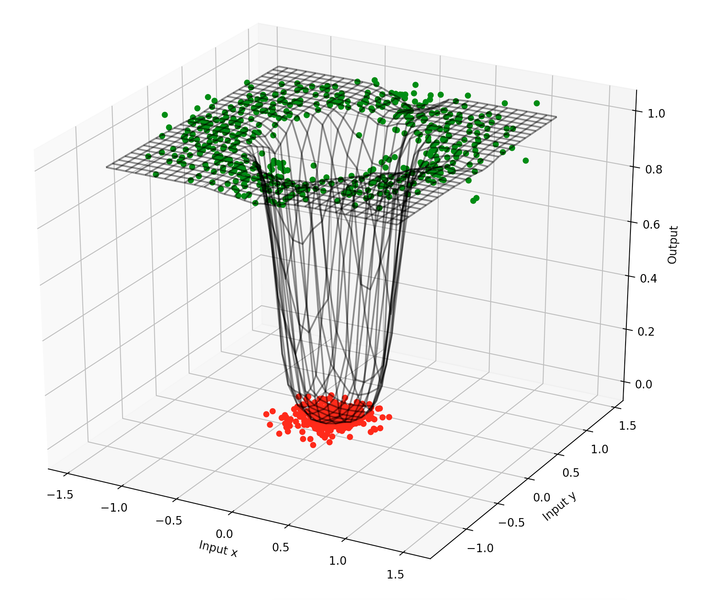

# Simple Quantum Kitchen Sink Implementation

A simple implementation of the approach presented by Christopher M. Wilson, J. S. Otterbach, Nikolas Tezak, Robert S. Smith, Gavin E. Crooks, and Marcus P. da Silva in their paper called Quantum Kitchen Sinks (arXiv:1806.08321) used on a toy example. 

The core idea of this approach is to have a certain amount of quantum circuits with gates that are parametrized by classical input. The circuits are each applied to the state ^{\otimes n}"/> and the results are then measured. The array of measurements is processed such that the measured state is one-hot encoded and this sparse object is used as input to a feedforward neural network with linear activations. 

(PLEASE NOTE: Currently in this implementation the measurements are not implemented according to the Born rule, but rather the result is always the possibility with the highest probability.) 

The classical inputs  that determine the quantum gates are preprocessed linearly with a mainly random (normal) matrix  and a random (uniform) vector  such that circuit parameters can be calculated as

.

Therefore all classical calculations of this approach are linear, whereas non-linearities are put onto the quantum kernels. 

The figure below shows the output of a quantum kitchen sink from this implementation over a given 2D input space for binary classification in addition to the training data that was used. The distributions for the two classes  in this example are 

,

where  is a normal distribution and the  are uniformly random.

